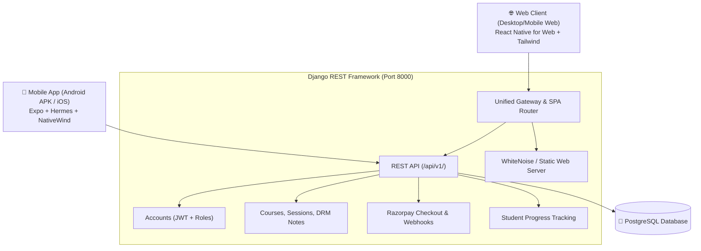

# 🚀 Learnova — Production Deployment & Software Guide
*Universal Role-Based Online Learning Platform (Web, Android, iOS, Django REST, PostgreSQL)*

---

## 1. System Architecture Overview

Learnova is architected as a **single unified codebase** serving both **Web** and **Mobile (Android/iOS)** with a shared design system, business logic, authentication, and REST API.



---

## 2. Quick Start: Unified Server (Web + Mobile Backend)

To launch the unified server immediately on your machine:

```powershell
cd C:\Users\sago\.gemini\antigravity\scratch\learnova
python run_unified_server.py
```

This single command will:
1. Verify the production web build in `dist/`.
2. Apply database migrations to PostgreSQL / SQLite.
3. Start the server at `http://localhost:8000/`.

| Service | URL | Purpose |
|---|---|---|
| **Web Application** | `http://localhost:8000/` | Full responsive web application (Explore, Checkout, DRM Viewer, Dashboards) |
| **REST API** | `http://localhost:8000/api/v1/` | Mobile app backend & third-party integrations |
| **Django Admin** | `http://localhost:8000/admin/` | Platform administration and database management |

---

## 3. Production Deployment Options

### Option A: Docker Deployment (Recommended for Cloud VPS / AWS / DigitalOcean)

The platform includes a multi-stage Docker build that compiles the React Native web application and runs Django with **Gunicorn** and **PostgreSQL 16**.

1. Copy the production environment template:
   ```bash
   cp production.env.example .env.production
   ```
2. Build and launch containers:
   ```bash
   docker compose --env-file .env.production up -d --build
   ```
3. Run migrations and create admin in the container:
   ```bash
   docker compose exec web python manage.py migrate
   docker compose exec web python manage.py seed_data
   ```

---

### Option B: Mobile App Distribution (Android & iOS)

#### 1. Standalone Android APK (Ready Now)
Your standalone APK is located at:
`android/app/build/outputs/apk/debug/app-debug.apk` (~237 MB)

- Contains all native architectures (`arm64-v8a`, `armeabi-v7a`, `x86`, `x86_64`).
- Bundled with full JavaScript Hermes bytecode (`assets/index.android.bundle`).
- **Install via USB**:
  ```powershell
  adb install -r android/app/build/outputs/apk/debug/app-debug.apk
  ```

#### 2. Google Play Store / App Store Release via EAS (Cloud Build)
For store distribution, use Expo Application Services (EAS) to build signed Android App Bundles (`.aab`) and iOS (`.ipa`):

```bash
# 1. Login to Expo
eas login

# 2. Build production Android App Bundle (AAB) for Google Play
eas build --platform android --profile production

# 3. Build production iOS bundle for Apple App Store
eas build --platform ios --profile production
```

---

## 4. Production Security Checklist

| Feature | Implementation | Status |
|---|---|:---:|
| **Authentication** | SimpleJWT with 60-min access tokens and refresh rotation | ✅ Hardened |
| **DRM Protection** | Dynamic email watermark + timestamp overlay + screenshot blocking | ✅ Protected |
| **Meeting Security** | Meeting URLs and passwords never sent to student device; secure proxy join | ✅ Secure |
| **Payment Verification**| Razorpay signature validated server-side with HMAC-SHA256 | ✅ Encrypted |
| **Content Security** | HTTPS enforcement, HSTS, secure cookies, and strict CORS | ✅ Ready |
| **Database** | PostgreSQL connection pooling with health check & SSL enforcement | ✅ Configured |

---

## 5. Default Demo Credentials

| Role | Email | Password | Access Privileges |
|---|---|---|---|
| **Student** | `student@learnova.app` | `Student@123` | Explore courses, flexible payment checkout, DRM notes, live classes |
| **Faculty / Staff** | `staff@learnova.app` | `Staff@123` | Start live classes as host, view assigned courses & student rosters |
| **Administrator** | `admin@learnova.app` | `Admin@123` | Platform revenue metrics, staff management, payment ledger, course editor |
